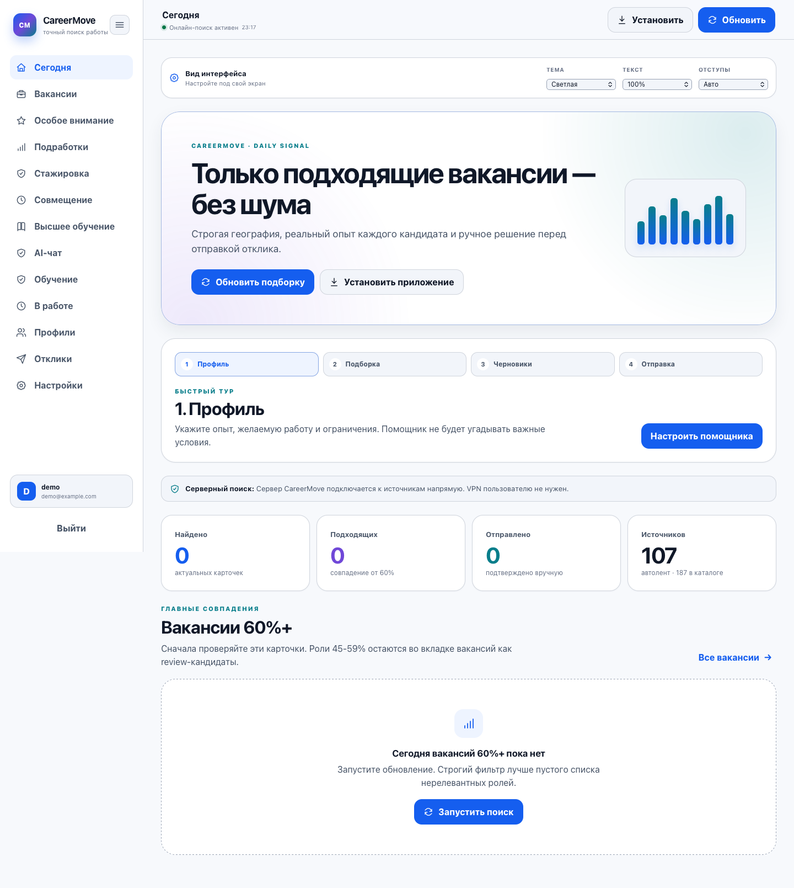
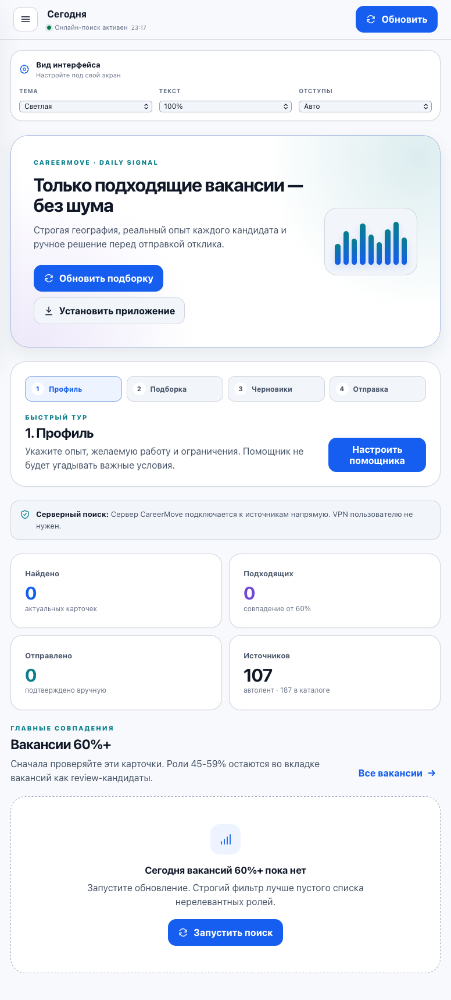
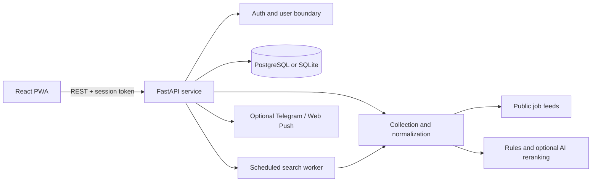

# CareerMove

> A privacy-aware workspace for international job discovery, candidate matching, and application preparation.


CareerMove turns a fragmented job search into one review queue. It collects public vacancies, normalizes and deduplicates them, evaluates each role against separate candidate profiles, and prepares reviewable application materials. The product never auto-submits an application.

This repository is a clean showcase edition. It contains fictional demo profiles and no production database, resumes, credentials, notification tokens, or configured private spreadsheet access.



<details>
<summary>Responsive mobile view</summary>



</details>

## Product scope

- Multi-source public vacancy collection with source-level diagnostics.
- Separate ranking for multiple candidates without mixing their histories.
- Freshness checks, cross-source deduplication, and state-preserving updates.
- Dedicated queues for vacancies, internships, side projects, and part-time-compatible roles.
- Deterministic matching with optional multi-provider AI reranking.
- Three editable cover-letter variants with candidate-specific contacts.
- Application tracking, favorites, daily planning, and PWA installation.
- Optional scheduled search and Telegram/Web Push notifications.

## Architecture



The React client owns interaction state while FastAPI owns authentication, search orchestration, ranking, and persistence. Source failures are isolated: one unavailable provider does not erase previously verified results. See [Architecture](docs/ARCHITECTURE.md) for boundaries and data flow.

## Quick start

Requirements: Python 3.13 and Node.js 22+.

```bash
git clone https://github.com/natalia-lebedinskaya/careermove-showcase.git
cd careermove-showcase

python3.13 -m venv .venv
source .venv/bin/activate
pip install -r requirements-api.txt
npm --prefix web ci

cp .env.example .env
cp web/.env.example web/.env.local
```

Run the API and web client in two terminals:

```bash
npm run api:dev
npm run web:dev
```

Open [http://localhost:5173](http://localhost:5173), create a local account, and use either generic candidate preset. `CAREERMOVE_LOCAL_DEMO=1` seeds fictional profiles only; it never downloads or restores production data.

## Verification

```bash
npm test
```

The command runs the public-release safety scan, API regression suite, Python compilation, frontend tests, and production frontend build.

## Engineering notes

- **Privacy boundary:** every user-owned query is scoped by `user_id`; reduced anonymous profile data is used for optional model calls.
- **Search reliability:** records retain `first_seen`, `last_seen`, publication time, source identity, and content hashes.
- **Graceful degradation:** local ranking and cached cards remain usable without model keys or when an individual feed fails.
- **Human control:** generated letters are drafts; sending and final vacancy verification remain explicit user actions.
- **Portable setup:** no developer-machine paths, bundled databases, or deployment metadata are committed.

## Documentation

- [Architecture and data flow](docs/ARCHITECTURE.md)
- [Five-minute employer demo](docs/DEMO.md)
- [Product decisions and limitations](docs/PRODUCT.md)
- [Security policy](SECURITY.md)

## License

MIT. Public vacancy providers retain ownership of their content and may impose their own API or attribution terms.
